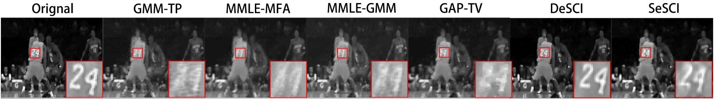
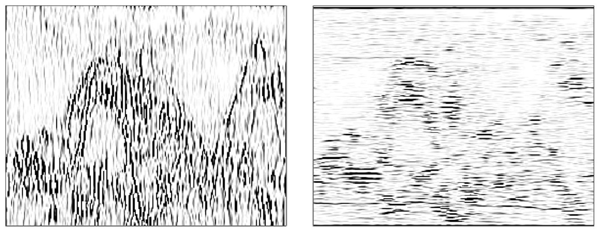

# Shearlet Enhanced Snapshot Compressive Imaging (SeSCI)

This is the repository for the regular paper **Shearlet Enhanced Snapshot Compressive Imaging** in the **IEEE Transactions on Image Processing (TIP)**  by [Peihao Yang](https://forsworns.github.io/), [Linghe Kong](http://www.cs.sjtu.edu.cn/~linghe.kong/), [Xiao-Yang Liu](http://www.tensorlet.com/), and [Xin Yuan](https://www.bell-labs.com/usr/x.yuan).  

## Snapshot Compressive Imaging

Snapshot compressive imaging (SCI) systems are developed to capture high-dimensional ($\geqslant3$) signals using low-dimensional off-the-shelf sensors. The multiple frames are compressed into a single measurement frame, thus saving memory, bandwidth and other resources.  The conciseness during the sampling makes it hard to reconstruct original frames. 

In this repository, we implement a reconstruction algorithm dubbed shearlet enhanced snapshot compressive imaging (SeSCI), which ensure accurate reconstruction in a short time. The performance of SeSCI origins from the joint sparsity prior on both frequency domain and shearlet domain. 

We conduct reconstruction experiments on two SCI systems named coded aperture compressive temporal imaging (CACTI) and coded aperture shapshot spectral imaging (CASSI). We compare the proposed SeSCI with other algorithms and make ablation experiments for SeSCI. We also reveal the generalization ability of SeSCI on a ghost imaging (GI) system. The related codes are listed under `experiments` folder.

Here is an example of the reconstructed image. 

<p align="center">

</p>

<p align="center">Figure 1: A reconstruction example.</p>

## Shearlet

The shearlet is a multi-scale image transform domain, which provides directional representation of the image signals. The directional coefficients help shearlet preserve the edge information, as shown in Figure 2.  In SeSCI, we assume that the compressed frames are sparse in the frequency domain and shearlet domain. During the implementation of SeSCI, we refer to the [ShearLab](https://www3.math.tu-berlin.de/numerik/www.shearlab-old.org/index.html) library.

<p align="center">

</p>

<p align="center">Figure 2: Shearlet preserves the edges information.</p>

## File directory

```bash
.
├── algorithms				# SeSCI implementation
├── dataset				# data mat files
├── experiments					
│   ├── ablation			# ablation experiments of SeSCI
│   ├── comparison			# comparison experiments on SCI
|   ├── extension			# an extensional experiment on GI 
│   └── sparsity			# sparsity observation
├── figure
├── results
└── utils				# utilities and other libs
```

## Usage

### Download the SeSCI repository

0. Install the MATLAB. The scripts have been verified in Matlab 2017b and 2018a.

1. Download the [ShearLab](https://www3.math.tu-berlin.de/numerik/www.shearlab-old.org/index.html) library for discrete shearlet transform. 

    For convenience, a simplified ShearLab has  been included in `./algorithms/ShearLab`. 

2. Get simulation dataset from [Google Drive](https://drive.google.com/open?id=1HMjf6ay6PQ379vzk8w09g6J7TxBnNjbF) or [Baidu Drive](https://pan.baidu.com/s/1Q3YeU9v4j9iQnG1dlyLDnw) (with access code ah6x).  

3. Download this repository via git
    ```bash
    git clone https://github.com/hust512/ShearLet_for_Snapshot_Compressive_Imaging.git
    ```
    or download the [zip file](https://github.com/hust512/ShearLet_for_Snapshot_Compressive_Imaging/archive/master.zip) manually.

4. Add the root folder to the Matlab path before running the scripts.

### Run SeSCI on high-speed video (CACTI)

To reproduce the experiment results in the Sec. VI A of the paper, we need to run the scripts in `./experiments/comparison/simulation_cacti`.  

#### `Kobe` video data

```matlab
./experiments/comparison/simulation_cacti/koben.m % or kobe.m
```
The only difference between these two files is the parameter setting.

#### `Aerial` video data

```matlab
./experiments/comparison/simulation_cacti/aerial.m
```

#### `Traffic` video data

```matlab
./experiments/comparison/simulation_cacti/traffic.m
```

### Run SeSCI on hyperspectral images (CASSI)

To reproduce the experiment results in the Sec. VI B of the paper, we need to run the scripts in `./experiments/comparison/simulation_cassi`.  The hyperspectral images are very large, i.e., `Toy` is of size $512\times512\times31$ and `Bird` is of size $703\times1021\times24$. Our testbed is with 16 GB memory. You need at least 8 GB memory for the reconstruction.

#### `toy` hyperspectral data

```matlab
./experiments/comparison/simulation_cassi/toy.m
```

#### `bird` hyperspectral data

```matlab
./experiments/comparison/simulation_cassi/bird.m
```

### Reproducing other experimental results:

- To reproduce the observation in the Sec. III A of the paper, run the scripts in `./experiments/sparsity`.

- To reproduce the ablation experiment results in the Sec. VI C of the paper, run the scripts in `./experiments/ablation`.

### Parameter tuning tips:

- The parameter `L` controls the step sizes in each iteration. The smaller `L` is, the faster  SeSCI converges.
- The $\lambda$ and $\sigma$ are used to control the denoisers on frequency domain and shearlet domain, respectively. 
- Increasing iteration number `niter` will promote the PSNR and consume more time.  

This repository only consists of the implementation and testing scripts for SeSCI. For the source codes of other algorithms in the experiments, please refer to [DeSCI](https://github.com/liuyang12/DeSCI), [GMM-TP](https://github.com/jianboyang/GMM-TP) and [MMLE-GMM](https://github.com/jianboyang/MMLE-GMM).

## Citation

```latex
@article{Peihao20SeSCI,
   author    = {Yang, Peihao and Kong, Linghe and Liu, Xiao-Yang and Yuan, Xin},
   title     = {Shearlet Enhanced Snapshot Compressive Imaging},
   journal   = {IEEE Transactions on Image Processing},
   publisher = {IEEE},
   year      = {2020},
   type      = {Journal Article},
   doi       = {10.1109/TIP.2020.2989550},
}
```

## Contact

[Peihao Yang, SJTU](yangpeihao@sjtu.edu.cn)


